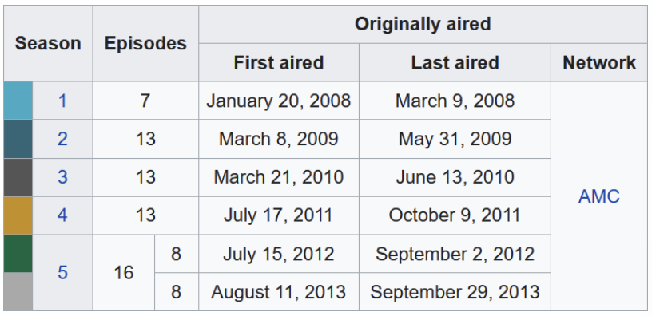

## All About Data 2

I took Data 2 in the spring semester of 2025, the start of my senior year. Although I'm studying behavioral neuroscience, I'm no stranger to programming, code, and data. I started my higher education journey at Kansas State University (Go Wildcats!) in 2015, where I studied computer science for 3 semesters, then digital media technology for another 3. During this time, I developed the foundational coding skills that Data 2 would later build on.

### What went well?

My favorite aspect of Data 2 was the data visualization. I really enjoy making data (which is often overwhelmingly vast) accessible to people of all skill levels. My background in programming gave me a strong lead in building visualizations, which gave me ample space to explore making my graphics clean.

Another major aspect of this course was data manipulation. This topic is quite a bit more complex. 

### Where did I struggle? (And how did I overcome these struggles?)

### Where should I go from here?


## Every Lecture Activity for Data 2

As the semester came to an end, I decided it would be beneficial to work through the entirety of the lecture activities for this course. It's a good way to revisit the fundamentals and rehearse all of the skills that I've learned since January.

### Libraries and resources

```{r}
library(tidyverse)
library(dplyr)
```


### Week 2

**Q 1**

*This one was just asking to correct the following commands that were throwing errors:*

- 1) `[20 + .2] \ 4.1`
- 2) `6 x (2 + 1,300)`

*These are pretty obvious formatting errors.*
- *Square brackets `[ ]` should instead be parentheses `( )` for grouping an operation.*
- *The back-slash `\` should be the forward-slash `/` for division*
- *An "x" was used instead of the asterisk for multiplication*
- *A comma was added to `1300`, disrupting the numeric value*

Solution:

```{r}
#| code-summary: "Simple arithmetic in R"

# 1)
(20 + 0.2) / 4.1

# 2)
6 * (2 + 1300)
```

**Q 2**

*This one is just about setting up a project in RStudio and developing a consistent organization and naming system for project files. I've done this extensively in the back end, I promise ;)*

**Q 3**

*The task for this one is simply to set up a Quarto document (done) and use an R code block as a calculator for a word problem. I'm going to take some liberty and write a calculator function, instead!*

*"It costs \$100 for each professor and \$25 for each student to register for a conference. Write a function to calculate the total cost for any professor-student combination."*

```{r}
#| code-summary: "Instantiate regCost() function"


regCost <- function(professors = 0, students = 0, profCost = 100, studCost = 25) {
  professorTotal <- professors * profCost
  studentTotal <- students * studCost
  registrationTotal <- professorTotal + studentTotal
  return(str_c("Total cost for registering ", professors, " professors and ", students, " students: $", registrationTotal))
}
```

*Example: 8 professors and 20 students*

```{r}
#| code-summary: "Run regCost for 8 professors and 20 students"
regCost(professors = 8, students = 20)
```

*Example: 2 professors and 32 students, but prices have increased to $110 for professors and $30 for students.*

```{r}
#| code-summary: "Run regCost for 8 professors (at $110 per) and 32 students (at $30 per)"
regCost(2, 32, 110, 30)
```

### Week 3

*We're still in the basic section of class, so it's mostly just more questions about variable assignment and function calls. As these topics are still pretty rudimentary, I'm going to editorialize a bit more and I will mostly just be providing the solutions for the questions until we get into more advanced topics.*

```{r}
#| code-summary: "Variable name debugging"


# score@T1 <- 3.2 will throw error - @ operator in var name
score_at_T1 <- 3.2
# score at <- 3.2 will throw error - spaces in var name
# 1_score <- 3.3 will throw error - var assignment starts with integer
ScoreAtTime1 <- 3.2
```

```{r}
y <- cos(3)
y
round(y)
round(y, 2)
```

*These questions covered vectors, strings, and packages*

```{r}
#| code-summary: "instantiating integer vectors and calculating with vectors"


sales <- c(30, 50, 40)
costs <- c(15, 15, 100)
profits <- sales - costs
profits
totalProfits <- sum(profits)
if_else(
  condition = totalProfits > 0,
  true = message <- "Total profit: $",
  false = message <- "Total debt: $"
)
writeLines(str_c(message, totalProfits))
```

```{r}
#| code-summary: "instantiating vectors with strings and demonstrating useful functions to summarize and manipulate strings"


flavors <- c("Cookies & Cream", "Americone Dream (R)", "Bob Marley's 1 Love")
length(flavors)
nchar(flavors)
str_to_upper(flavors)
```

```{r}
#| code-summary: "Browsing vignettes to access documentation from libraries"
#| eval: false


browseVignettes("tidyverse")
```


### Week 4

*This question tasked us with tidying the following table:* 

```{r}
#| code-summary: "Tidying the data"

# Establish data vectors
season <- c(1, 2, 3, 4, 5.1, 5.2)
episodes <- c(7, 13, 13, 13, 8, 8)
firstAired <- mdy(c("01-20-2008", "03-08-2009", "03-21-2010", "07-17-2011", "07-15-2012", "08-11-2013"))
lastAired <- mdy(c("03-09-2008", "05-31-2009", "06-13-2010", "08-09-2011", "10-02-2012", "10-02-2013"))

# Construct the tibble
breaking_bad <- tibble(
  Season = season,
  Episodes = episodes,
  First_Aired = firstAired,
  Last_Aired = lastAired,
  Network = "AMC"
) |>
  print()
```

```{r}
#| code-summary: "Saving resulting tibble to .csv file"


```

### Week 5

### Week 6

### Week 11

### Week 12

### Week 13

### Week 14


